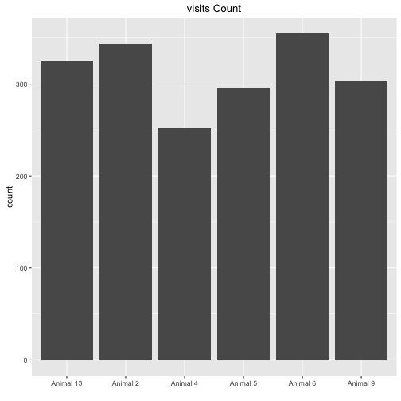
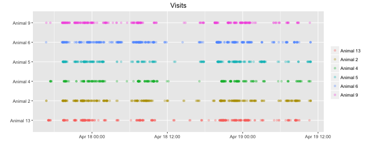
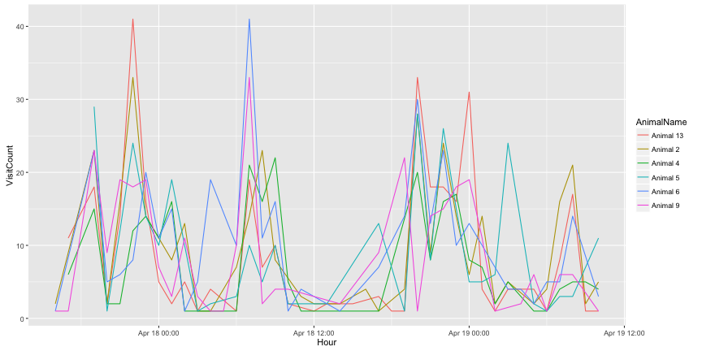

FreeAdaptation20160417
===================

This is a free adaptation log, the mice had 2 days of free adaptation with no cue, door is always open. and on the 17th we replaced it to a free adaptation: between 19:00-24:00 the door opens and a light cue apears for 5 sec, when the light disappears the door is closed and it wouldn't open until a new visit will occour. between 24:00-19:00 the door is closed and when the mice nosepoke it they get a 15kHz sound for negative reinforcement.

This R markdown requires ggplot2 package and will install it if it doesn't exist.  


It read the "animals.txt", "visits.txt" and "nosepokes.txt" files,    

and assigns animal name for each event as a factor(visit and nosepoke).  


This is the visit count with the appropriate plot  

```
## 
## Animal 13  Animal 2  Animal 4  Animal 5  Animal 6  Animal 9 
##       325       344       252       295       355       303
```



Visits over time for each animal   


Visit count across absoulute time  





This is the hour with the maximun number of visits  

```
## [1] "2016-04-18 20:00:00 IDT"
```


  

