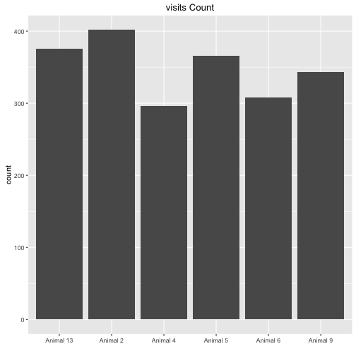
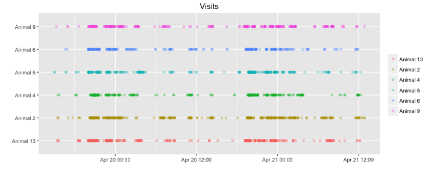
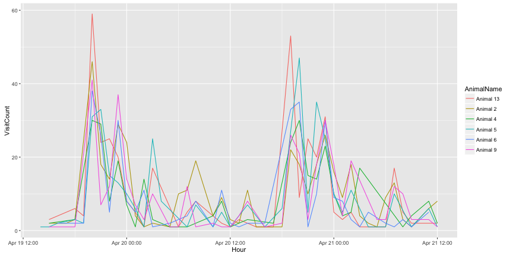
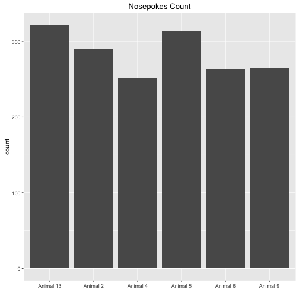
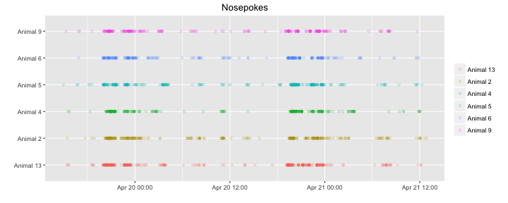
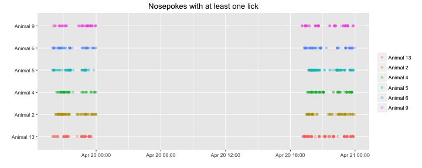
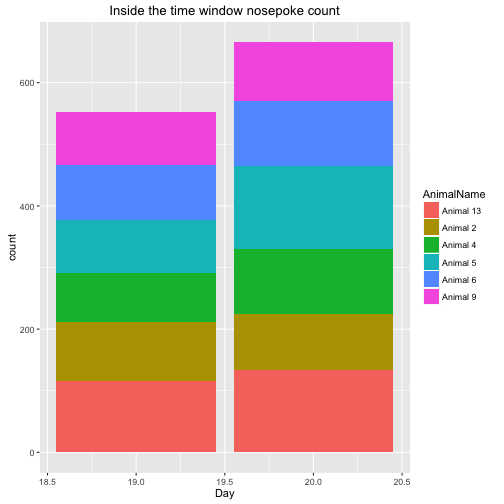
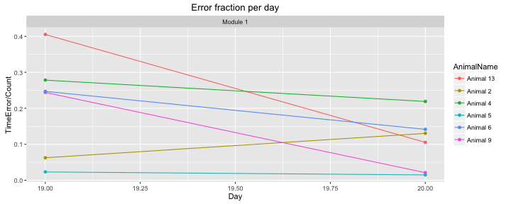
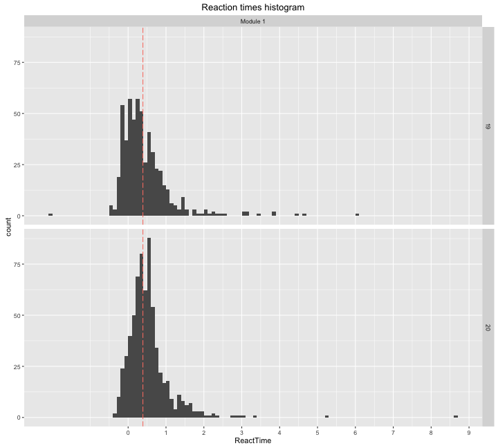
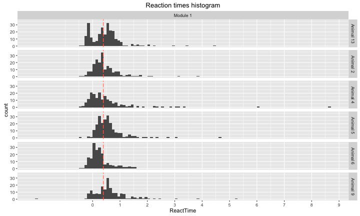

NosepokeAdaptation20160419
=======================

Upon a visit a delay timer of 0.5s starts then a light cue appears for 5s within the time of the light cue it is possible to open the door with a nosepoke, otherwise it counts as a time error. 

This R markdown requires ggplot2 package and will install it if it doesn't exist.  


It read the "animals.txt", "visits.txt" and "nosepokes.txt" files, removes all non-first nosepokes    

and assigns animal name for each event as a factor(visit and nosepoke).  


This is the visit count with the appropriate plot  

```
## 
## Animal 13  Animal 2  Animal 4  Animal 5  Animal 6  Animal 9 
##       376       402       296       366       308       343
```



Visits over time for each animal   


Visit count across absoulute time  





This is the hour with the maximun number of visits  

```
## [1] "2016-04-19 20:00:00 IDT"
```


This is the nosepokes count with the appropriate plot 

```
## 
## Animal 13  Animal 2  Animal 4  Animal 5  Animal 6  Animal 9 
##       322       290       252       314       263       265
```




Nosepokes over time for each animal


Check that drinking occoured only in the 19:00 23:59 time window, it shows the nosepokes where atleast one lick had happend, horizontal lines show the time window were the corner is active.



This is a plot showing the amount of nosepokes in the time window per day per animal  

```
## Error in `$<-.data.frame`(`*tmp*`, "Hour", value = c(14L, 15L, 15L, 15L, : replacement has 1526 rows, data has 1706
```



This is the count of nosepokes per day per animal in the time windows


This is a plot showing the fraction of errors per time window per module,
the number of the module corresponds the anticipation time in seconds.


```
##    AnimalName Day ModuleName Count TimeError
## 1   Animal 13  19   Module 1   116        47
## 2    Animal 9  19   Module 1    86        21
## 3    Animal 5  19   Module 1    86         2
## 4    Animal 6  19   Module 1    89        22
## 5    Animal 4  19   Module 1    79        22
## 6    Animal 2  19   Module 1    96         6
## 7   Animal 13  20   Module 1   133        14
## 8    Animal 9  20   Module 1    95         2
## 9    Animal 5  20   Module 1   135         2
## 10   Animal 6  20   Module 1   106        15
## 11   Animal 4  20   Module 1   105        23
## 12   Animal 2  20   Module 1    92        12
```

This is an histogram showing the reaction times(values under zero are nosepokes before the light cue) by Day by anticipation time, the salmon colored line is the overall median reaction time:


```
## [1] "The median reaction time in seconds:0.389999866485596"
```
This is an histogram showing the reaction times(values under zero are nosepokes before the light cue) by animal by anticipation time, the salmon colored line is the overall median reaction time:


## Conclusion
Its seems like the mice have learn to nosepoke in time, we cannot conclude if they associate the light with the possibility to open.
.
