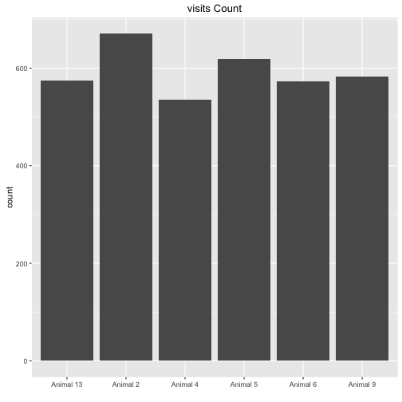
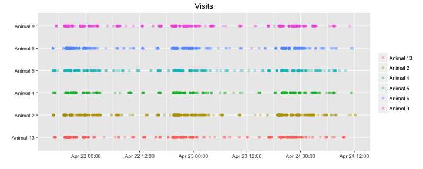
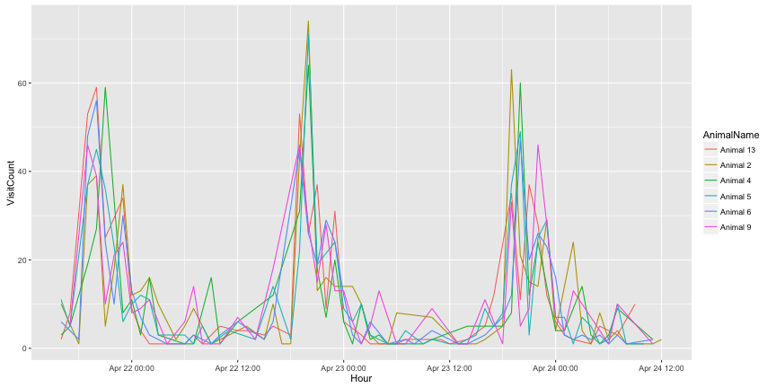
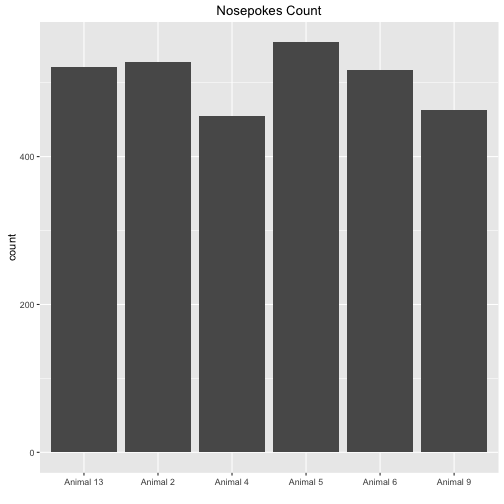
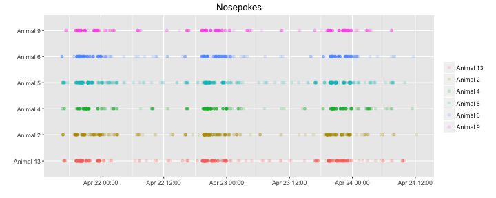
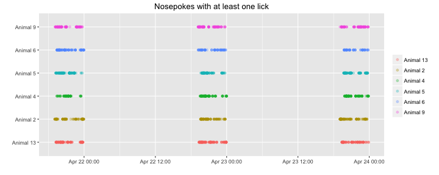
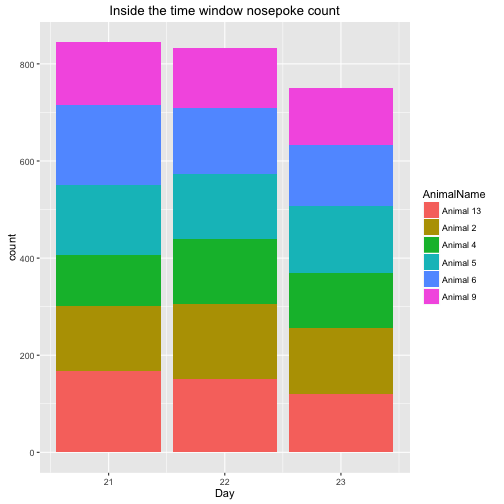
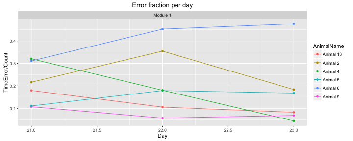

NosepokeAdaptation20160421
=======================

Upon a visit a delay timer of 0.5s starts then a light cue appears for 0.9s within the time of the light cue it is possible to open the door with a nosepoke, otherwise it counts as a time error. 

This R markdown requires ggplot2 package and will install it if it doesn't exist.  


It read the "animals.txt", "visits.txt" and "nosepokes.txt" files, removes all non-first nosepokes    

and assigns animal name for each event as a factor(visit and nosepoke).  


This is the visit count with the appropriate plot  

```
## 
## Animal 13  Animal 2  Animal 4  Animal 5  Animal 6  Animal 9 
##       574       671       536       619       573       583
```



Visits over time for each animal   


Visit count across absoulute time  





This is the hour with the maximun number of visits  

```
## [1] "2016-04-22 20:00:00 IDT"
```


This is the nosepokes count with the appropriate plot 

```
## 
## Animal 13  Animal 2  Animal 4  Animal 5  Animal 6  Animal 9 
##       521       528       455       555       517       463
```




Nosepokes over time for each animal


Check that drinking occoured only in the 19:00 23:59 time window, it shows the nosepokes where atleast one lick had happend, horizontal lines show the time window were the corner is active.



This is a plot showing the amount of nosepokes in the time window per day per animal  

```
## Error in `$<-.data.frame`(`*tmp*`, "Hour", value = c(16L, 16L, 16L, 16L, : replacement has 2913 rows, data has 3039
```



This is the count of nosepokes per day per animal in the time windows


This is a plot showing the fraction of errors per time window per module,
the number of the module corresponds the anticipation time in seconds.


```
##    AnimalName Day ModuleName Count TimeError
## 1   Animal 13  21   Module 1   167        30
## 2    Animal 9  21   Module 1   130        14
## 3    Animal 5  21   Module 1   144        16
## 4    Animal 6  21   Module 1   164        51
## 5    Animal 4  21   Module 1   106        34
## 6    Animal 2  21   Module 1   134        29
## 7   Animal 13  22   Module 1   151        16
## 8    Animal 9  22   Module 1   123         7
## 9    Animal 5  22   Module 1   134        24
## 10   Animal 6  22   Module 1   137        62
## 11   Animal 4  22   Module 1   133        24
## 12   Animal 2  22   Module 1   155        55
## 13  Animal 13  23   Module 1   121        10
## 14   Animal 9  23   Module 1   117         8
## 15   Animal 5  23   Module 1   137        23
## 16   Animal 6  23   Module 1   126        60
## 17   Animal 4  23   Module 1   113         5
## 18   Animal 2  23   Module 1   136        25
```

This is an histogram showing the reaction times(values under zero are nosepokes before the light cue) by Day by anticipation time, the salmon colored line is the overall median reaction time:


```
## [1] "The median reaction time in seconds:0.279999971389771"
```
This is an histogram showing the reaction times(values under zero are nosepokes before the light cue) by animal by anticipation time, the salmon colored line is the overall median reaction time:


## Conclusion
Its seems like the mice have learn to nosepoke in time, we cannot conclude if they associate the light with the possibility to open.
