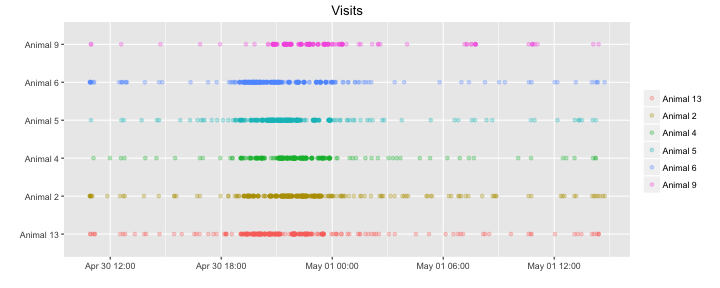
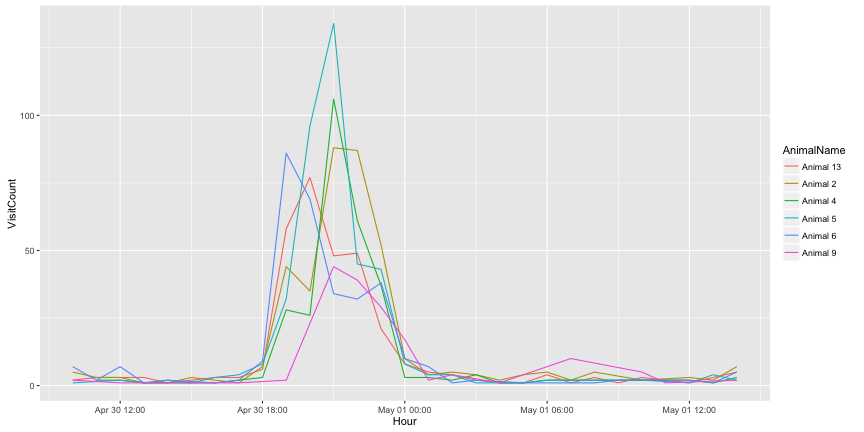
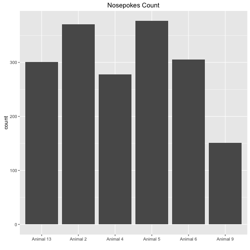
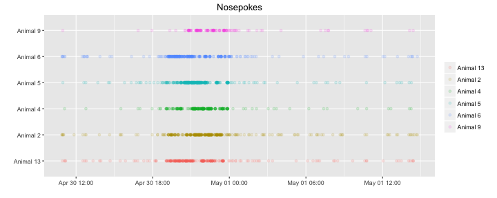
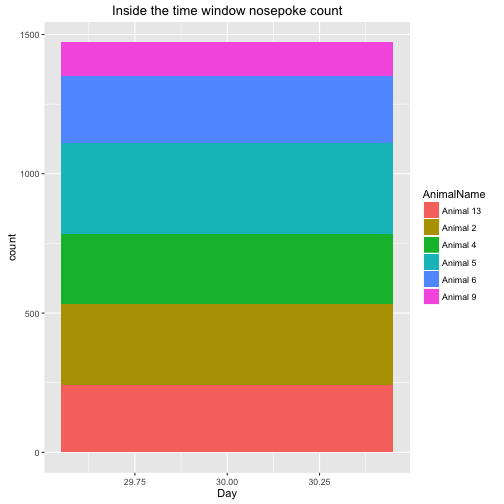
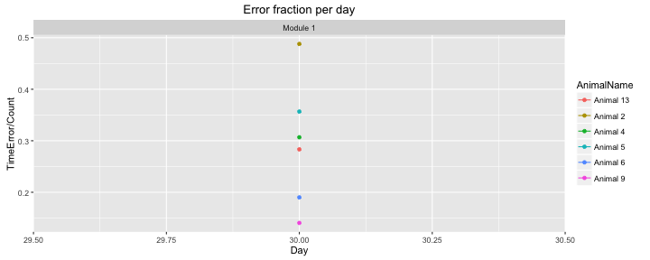
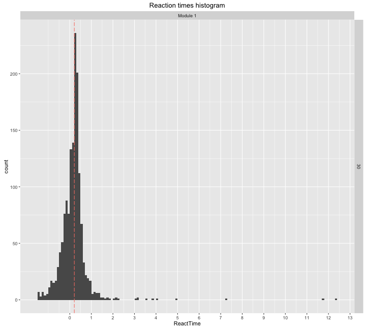

DelayCueAdapt20160430
=======================

Upon a visit a delay timer of 1.5s starts then a light cue appears for 1.5s within the time of the light cue it is possible to open the door with a nosepoke, otherwise it counts as a time error. 

This R markdown requires ggplot2 package and will install it if it doesn't exist.  


It read the "animals.txt", "visits.txt" and "nosepokes.txt" files, removes all non-first nosepokes    

and assigns animal name for each event as a factor(visit and nosepoke).  


This is the visit count with the appropriate plot  

```
## 
## Animal 13  Animal 2  Animal 4  Animal 5  Animal 6  Animal 9 
##       321       387       297       405       326       185
```


Visits over time for each animal   


Visit count across absoulute time  





This is the hour with the maximun number of visits  

```
## [1] "2016-04-30 21:00:00 IDT"
```


This is the nosepokes count with the appropriate plot 

```
## 
## Animal 13  Animal 2  Animal 4  Animal 5  Animal 6  Animal 9 
##       301       371       278       377       305       151
```




Nosepokes over time for each animal


Check that drinking occoured only in the 19:00 23:59 time window, it shows the nosepokes where atleast one lick had happend, horizontal lines show the time window were the corner is active.


This is a plot showing the amount of nosepokes in the time window per day per animal  

```
## Error in `$<-.data.frame`(`*tmp*`, "Hour", value = c(10L, 10L, 10L, 10L, : replacement has 1582 rows, data has 1783
```



This is the count of nosepokes per day per animal in the time windows


This is a plot showing the fraction of errors per time window per module,
the number of the module corresponds the anticipation time in seconds.

```
## geom_path: Each group consists of only one observation. Do you need to
## adjust the group aesthetic?
```



```
##   AnimalName Day ModuleName Count TimeError
## 1  Animal 13  30   Module 1   240        68
## 2   Animal 9  30   Module 1   121        17
## 3   Animal 5  30   Module 1   328       117
## 4   Animal 6  30   Module 1   242        46
## 5   Animal 4  30   Module 1   251        77
## 6   Animal 2  30   Module 1   291       142
```

This is an histogram showing the reaction times(values under zero are nosepokes before the light cue) by Day by anticipation time, the salmon colored line is the overall median reaction time:


```
## [1] "The median reaction time in seconds:0.210000038146973"
```
This is an histogram showing the reaction times(values under zero are nosepokes before the light cue) by animal by day, the salmon colored line is the overall median reaction time:


##Conclusion  
The mice finally associate the light cue with the possibility to open then door.
