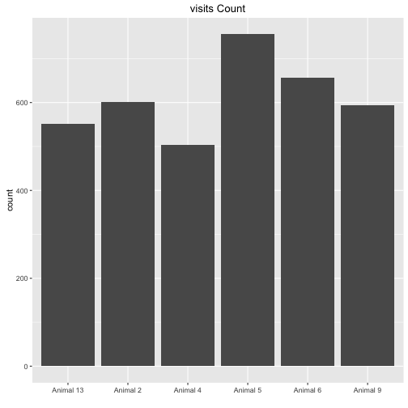
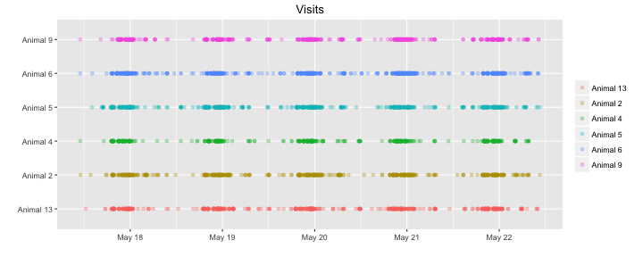
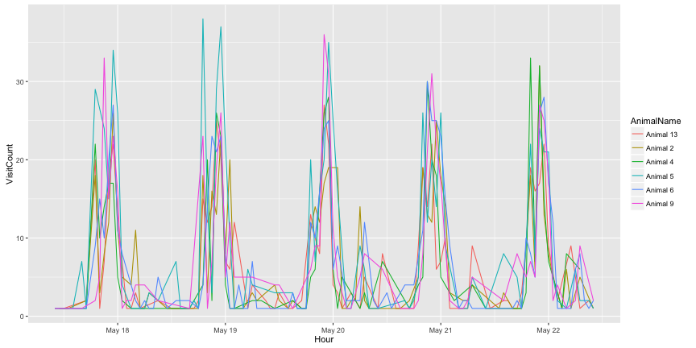
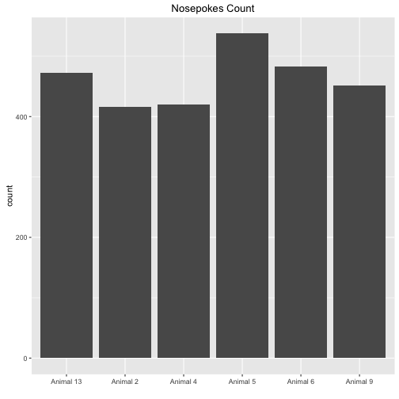
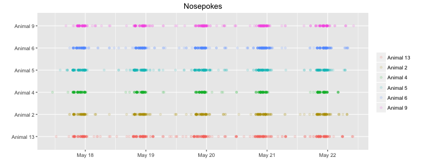
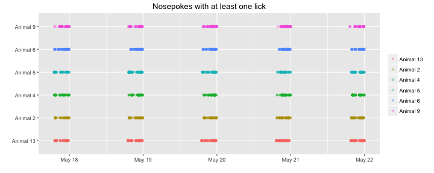
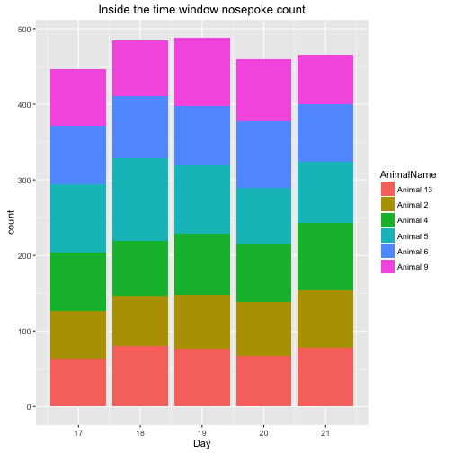
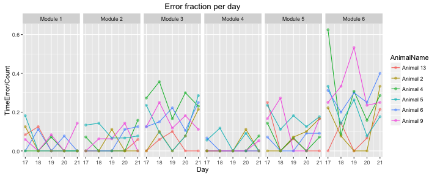
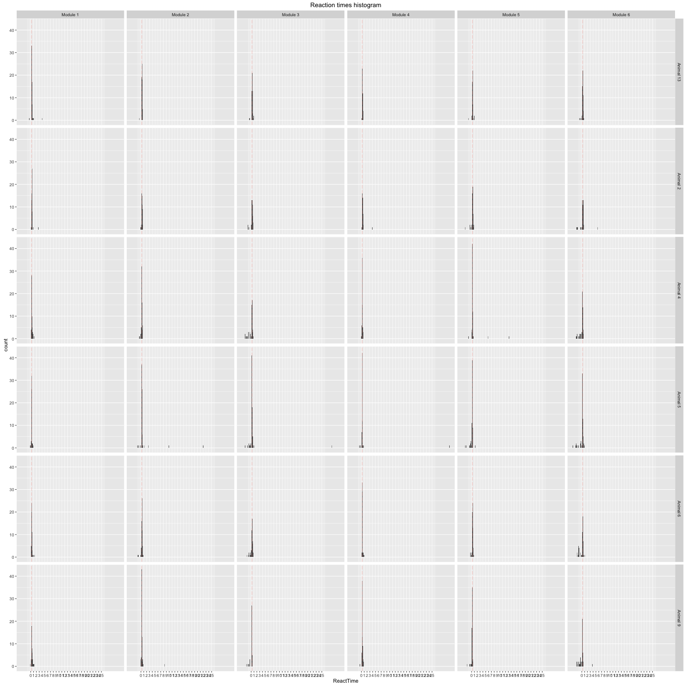
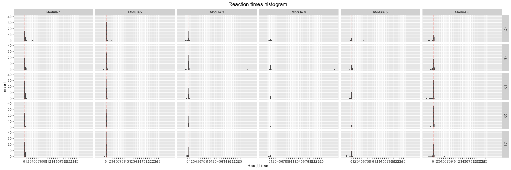

Task_20160516
=======================

Upon a visit a random delay timer of {1.5s, 2.5, 3.5} starts then a light cue appears for 0.9s within the time of the light cue it is possible to open the door with a nosepoke, otherwise it counts as a time error{with no negative reinforcement sound}.

Mice recived 10uL saline per g.
Mouse 4 was injoured in the back right leg(at sunday 20160515).

This R markdown requires ggplot2 package and will install it if it doesn't exist.  


It read the "animals.txt", "visits.txt" and "nosepokes.txt" files, removes all non-first nosepokes    

and assigns animal name for each event as a factor(visit and nosepoke).  


This is the visit count with the appropriate plot  

```
## 
## Animal 13  Animal 2  Animal 4  Animal 5  Animal 6  Animal 9 
##       552       602       504       756       657       593
```



Visits over time for each animal   


Visit count across absoulute time  





This is the hour with the maximun number of visits  

```
## [1] "2016-05-19 23:00:00 IDT"
```


This is the nosepokes count with the appropriate plot 

```
## 
## Animal 13  Animal 2  Animal 4  Animal 5  Animal 6  Animal 9 
##       472       416       420       538       483       452
```




Nosepokes over time for each animal


Check that drinking occoured only in the 19:00 23:59 time window, it shows the nosepokes where atleast one lick had happend, horizontal lines show the time window were the corner is active.



This is a plot showing the amount of nosepokes in the time window per day per animal  

```
## Error in `$<-.data.frame`(`*tmp*`, "Hour", value = c(10L, 12L, 14L, 16L, : replacement has 2705 rows, data has 2781
```



This is the count of nosepokes per day per animal in the time windows


This is a plot showing the fraction of errors per time window per module,
the number of the module corresponds the anticipation time in seconds.


```
##     AnimalName Day ModuleName Count TimeError ErrorFraction
## 1    Animal 13  17   Module 3     7         0    0.00000000
## 2     Animal 9  17   Module 3     8         1    0.12500000
## 3     Animal 5  17   Module 3    17         4    0.23529412
## 4     Animal 6  17   Module 3     8         1    0.12500000
## 5     Animal 4  17   Module 3    11         3    0.27272727
## 6     Animal 2  17   Module 3     9         0    0.00000000
## 7    Animal 13  18   Module 3    17         1    0.05882353
## 8     Animal 9  18   Module 3     8         2    0.25000000
## 9     Animal 5  18   Module 3    21         2    0.09523810
## 10    Animal 6  18   Module 3    20         3    0.15000000
## 11    Animal 4  18   Module 3    14         5    0.35714286
## 12    Animal 2  18   Module 3    10         1    0.10000000
## 13   Animal 13  19   Module 3    10         1    0.10000000
## 14    Animal 9  19   Module 3    17         2    0.11764706
## 15    Animal 5  19   Module 3    18         0    0.00000000
## 16    Animal 6  19   Module 3     9         2    0.22222222
## 17    Animal 4  19   Module 3    12         2    0.16666667
## 18    Animal 2  19   Module 3     7         0    0.00000000
## 19   Animal 13  20   Module 3    11         0    0.00000000
## 20    Animal 9  20   Module 3    11         2    0.18181818
## 21    Animal 5  20   Module 3    13         1    0.07692308
## 22    Animal 6  20   Module 3    19         2    0.10526316
## 23    Animal 4  20   Module 3    10         3    0.30000000
## 24    Animal 2  20   Module 3    13         1    0.07692308
## 25   Animal 13  21   Module 3    11         0    0.00000000
## 26    Animal 9  21   Module 3     9         1    0.11111111
## 27    Animal 5  21   Module 3    14         4    0.28571429
## 28    Animal 6  21   Module 3    12         3    0.25000000
## 29    Animal 4  21   Module 3    13         3    0.23076923
## 30    Animal 2  21   Module 3    14         3    0.21428571
## 31   Animal 13  17   Module 2    16         0    0.00000000
## 32    Animal 9  17   Module 2    14         0    0.00000000
## 33    Animal 5  17   Module 2    15         2    0.13333333
## 34    Animal 6  17   Module 2    13         0    0.00000000
## 35    Animal 4  17   Module 2    14         1    0.07142857
## 36    Animal 2  17   Module 2    12         0    0.00000000
## 37   Animal 13  18   Module 2    15         0    0.00000000
## 38    Animal 9  18   Module 2    16         1    0.06250000
## 39    Animal 5  18   Module 2    21         3    0.14285714
## 40    Animal 6  18   Module 2    12         0    0.00000000
## 41    Animal 4  18   Module 2    14         0    0.00000000
## 42    Animal 2  18   Module 2    10         0    0.00000000
## 43   Animal 13  19   Module 2    10         0    0.00000000
## 44    Animal 9  19   Module 2    16         1    0.06250000
## 45    Animal 5  19   Module 2    15         1    0.06666667
## 46    Animal 6  19   Module 2    17         0    0.00000000
## 47    Animal 4  19   Module 2    10         0    0.00000000
## 48    Animal 2  19   Module 2     9         1    0.11111111
## 49   Animal 13  20   Module 2    10         0    0.00000000
## 50    Animal 9  20   Module 2    14         2    0.14285714
## 51    Animal 5  20   Module 2    15         1    0.06666667
## 52    Animal 6  20   Module 2    18         2    0.11111111
## 53    Animal 4  20   Module 2    10         0    0.00000000
## 54    Animal 2  20   Module 2    13         0    0.00000000
## 55   Animal 13  21   Module 2    17         1    0.05882353
## 56    Animal 9  21   Module 2    10         0    0.00000000
## 57    Animal 5  21   Module 2    13         1    0.07692308
## 58    Animal 6  21   Module 2     8         1    0.12500000
## 59    Animal 4  21   Module 2    19         3    0.15789474
## 60    Animal 2  21   Module 2    13         0    0.00000000
## 61   Animal 13  17   Module 5     8         2    0.25000000
## 62    Animal 9  17   Module 5    12         2    0.16666667
## 63    Animal 5  17   Module 5    17         4    0.23529412
## 64    Animal 6  17   Module 5    14         1    0.07142857
## 65    Animal 4  17   Module 5    14         2    0.14285714
## 66    Animal 2  17   Module 5    13         0    0.00000000
## 67   Animal 13  18   Module 5    12         0    0.00000000
## 68    Animal 9  18   Module 5    11         3    0.27272727
## 69    Animal 5  18   Module 5    18         2    0.11111111
## 70    Animal 6  18   Module 5    14         0    0.00000000
## 71    Animal 4  18   Module 5     6         0    0.00000000
## 72    Animal 2  18   Module 5    11         0    0.00000000
## 73   Animal 13  19   Module 5    16         1    0.06250000
## 74    Animal 9  19   Module 5    16         0    0.00000000
## 75    Animal 5  19   Module 5    11         2    0.18181818
## 76    Animal 6  19   Module 5    18         0    0.00000000
## 77    Animal 4  19   Module 5    15         1    0.06666667
## 78    Animal 2  19   Module 5    14         1    0.07142857
## 79   Animal 13  20   Module 5    11         0    0.00000000
## 80    Animal 9  20   Module 5    14         0    0.00000000
## 81    Animal 5  20   Module 5     8         1    0.12500000
## 82    Animal 6  20   Module 5    11         1    0.09090909
## 83    Animal 4  20   Module 5    18         0    0.00000000
## 84    Animal 2  20   Module 5    10         1    0.10000000
## 85   Animal 13  21   Module 5     5         0    0.00000000
## 86    Animal 9  21   Module 5    12         2    0.16666667
## 87    Animal 5  21   Module 5    17         3    0.17647059
## 88    Animal 6  21   Module 5    11         1    0.09090909
## 89    Animal 4  21   Module 5    14         1    0.07142857
## 90    Animal 2  21   Module 5    18         3    0.16666667
## 91   Animal 13  17   Module 6     6         0    0.00000000
## 92    Animal 9  17   Module 6     8         2    0.25000000
## 93    Animal 5  17   Module 6    12         4    0.33333333
## 94    Animal 6  17   Module 6    16         5    0.31250000
## 95    Animal 4  17   Module 6     8         5    0.62500000
## 96    Animal 2  17   Module 6     9         2    0.22222222
## 97   Animal 13  18   Module 6    14         2    0.14285714
## 98    Animal 9  18   Module 6    12         4    0.33333333
## 99    Animal 5  18   Module 6    14         2    0.14285714
## 100   Animal 6  18   Module 6    10         2    0.20000000
## 101   Animal 4  18   Module 6    12         1    0.08333333
## 102   Animal 2  18   Module 6    13         1    0.07692308
## 103  Animal 13  19   Module 6    13         0    0.00000000
## 104   Animal 9  19   Module 6    15         8    0.53333333
## 105   Animal 5  19   Module 6    19         5    0.26315789
## 106   Animal 6  19   Module 6    10         3    0.30000000
## 107   Animal 4  19   Module 6    13         4    0.30769231
## 108   Animal 2  19   Module 6    12         0    0.00000000
## 109  Animal 13  20   Module 6    15         1    0.06666667
## 110   Animal 9  20   Module 6    17         4    0.23529412
## 111   Animal 5  20   Module 6    13         1    0.07692308
## 112   Animal 6  20   Module 6    12         3    0.25000000
## 113   Animal 4  20   Module 6    19         3    0.15789474
## 114   Animal 2  20   Module 6    13         0    0.00000000
## 115  Animal 13  21   Module 6    14         3    0.21428571
## 116   Animal 9  21   Module 6     8         2    0.25000000
## 117   Animal 5  21   Module 6    17         3    0.17647059
## 118   Animal 6  21   Module 6    15         6    0.40000000
## 119   Animal 4  21   Module 6    14         4    0.28571429
## 120   Animal 2  21   Module 6     9         3    0.33333333
## 121  Animal 13  17   Module 1    12         1    0.08333333
## 122   Animal 9  17   Module 1    17         1    0.05882353
## 123   Animal 5  17   Module 1    11         2    0.18181818
## 124   Animal 6  17   Module 1    12         0    0.00000000
## 125   Animal 4  17   Module 1    18         0    0.00000000
## 126   Animal 2  17   Module 1     8         1    0.12500000
## 127  Animal 13  18   Module 1    16         2    0.12500000
## 128   Animal 9  18   Module 1    11         0    0.00000000
## 129   Animal 5  18   Module 1    19         0    0.00000000
## 130   Animal 6  18   Module 1     9         1    0.11111111
## 131   Animal 4  18   Module 1    10         0    0.00000000
## 132   Animal 2  18   Module 1    12         0    0.00000000
## 133  Animal 13  19   Module 1    16         0    0.00000000
## 134   Animal 9  19   Module 1    12         1    0.08333333
## 135   Animal 5  19   Module 1    13         0    0.00000000
## 136   Animal 6  19   Module 1    14         0    0.00000000
## 137   Animal 4  19   Module 1    14         1    0.07142857
## 138   Animal 2  19   Module 1    22         0    0.00000000
## 139  Animal 13  20   Module 1    11         0    0.00000000
## 140   Animal 9  20   Module 1    13         0    0.00000000
## 141   Animal 5  20   Module 1    15         0    0.00000000
## 142   Animal 6  20   Module 1    13         1    0.07692308
## 143   Animal 4  20   Module 1    10         0    0.00000000
## 144   Animal 2  20   Module 1    13         0    0.00000000
## 145  Animal 13  21   Module 1    15         0    0.00000000
## 146   Animal 9  21   Module 1     7         1    0.14285714
## 147   Animal 5  21   Module 1    12         0    0.00000000
## 148   Animal 6  21   Module 1    18         0    0.00000000
## 149   Animal 4  21   Module 1    16         0    0.00000000
## 150   Animal 2  21   Module 1    12         0    0.00000000
## 151  Animal 13  17   Module 4    14         0    0.00000000
## 152   Animal 9  17   Module 4    15         0    0.00000000
## 153   Animal 5  17   Module 4    18         1    0.05555556
## 154   Animal 6  17   Module 4    15         1    0.06666667
## 155   Animal 4  17   Module 4    12         0    0.00000000
## 156   Animal 2  17   Module 4    13         0    0.00000000
## 157  Animal 13  18   Module 4     6         0    0.00000000
## 158   Animal 9  18   Module 4    15         0    0.00000000
## 159   Animal 5  18   Module 4    17         2    0.11764706
## 160   Animal 6  18   Module 4    17         0    0.00000000
## 161   Animal 4  18   Module 4    16         0    0.00000000
## 162   Animal 2  18   Module 4    11         0    0.00000000
## 163  Animal 13  19   Module 4    12         0    0.00000000
## 164   Animal 9  19   Module 4    14         0    0.00000000
## 165   Animal 5  19   Module 4    14         0    0.00000000
## 166   Animal 6  19   Module 4    11         0    0.00000000
## 167   Animal 4  19   Module 4    17         0    0.00000000
## 168   Animal 2  19   Module 4     7         0    0.00000000
## 169  Animal 13  20   Module 4     9         0    0.00000000
## 170   Animal 9  20   Module 4    12         0    0.00000000
## 171   Animal 5  20   Module 4    11         1    0.09090909
## 172   Animal 6  20   Module 4    16         0    0.00000000
## 173   Animal 4  20   Module 4     9         0    0.00000000
## 174   Animal 2  20   Module 4     9         1    0.11111111
## 175  Animal 13  21   Module 4    16         0    0.00000000
## 176   Animal 9  21   Module 4    19         1    0.05263158
## 177   Animal 5  21   Module 4     8         0    0.00000000
## 178   Animal 6  21   Module 4    12         0    0.00000000
## 179   Animal 4  21   Module 4    13         1    0.07692308
## 180   Animal 2  21   Module 4    10         0    0.00000000
```

This is an histogram showing the reaction times(values under zero are nosepokes before the light cue) by Day by anticipation time, the salmon colored line is the overall median reaction time:


```
## [1] "The median reaction time in seconds:0.299999952316284"
```





##Conclusion  
