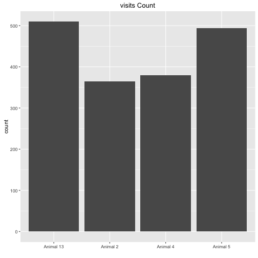
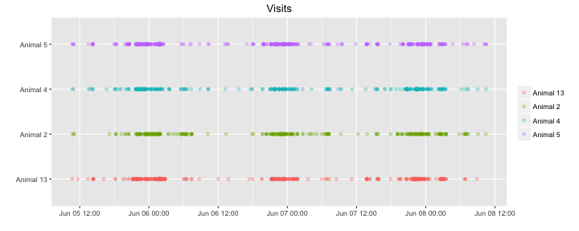
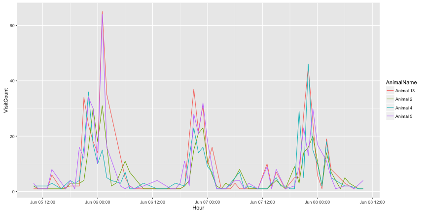
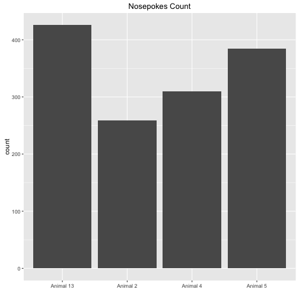
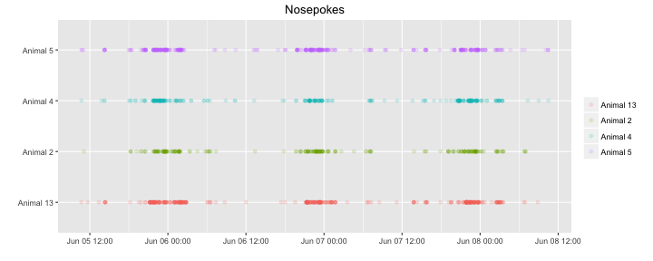
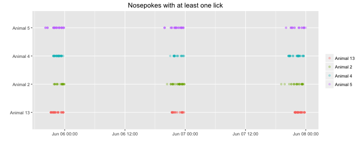
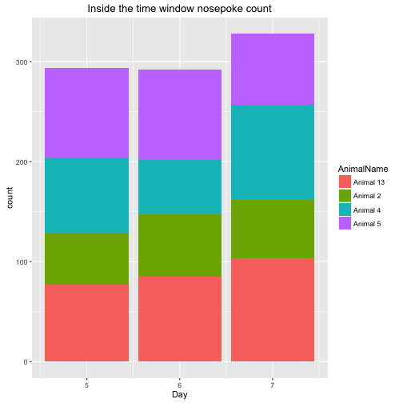
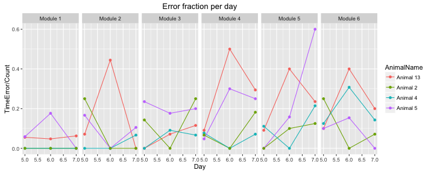
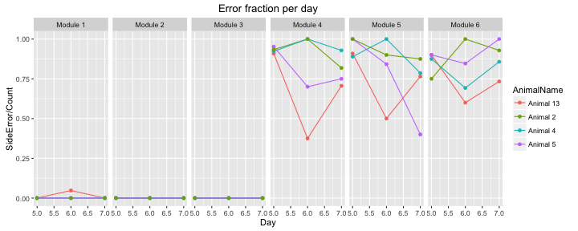
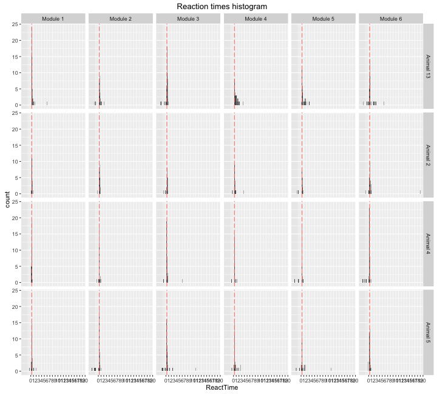

TaskTraining3_20160605
=======================

Upon a visit a random delay timer of {1.5s, 2.5, 3.5} starts then a light cue appears for 0.9s within the time of the light cue it is possible to open the door with a nosepoke, otherwise it counts as a time error{with no negative reinforcement sound}, The door is randomized with p=0.5 for each door.

This R markdown requires ggplot2 package and will install it if it doesn't exist.  


It read the "animals.txt", "visits.txt" and "nosepokes.txt" files, removes all non-first nosepokes    

and assigns animal name for each event as a factor(visit and nosepoke).  


This is the visit count with the appropriate plot  

```
## 
## Animal 13  Animal 2  Animal 4  Animal 5 
##       510       364       379       494
```



Visits over time for each animal   


Visit count across absoulute time  





This is the hour with the maximun number of visits  

```
## [1] "2016-06-06 01:00:00 IDT"
```


This is the nosepokes count with the appropriate plot 

```
## 
## Animal 13  Animal 2  Animal 4  Animal 5 
##       426       259       310       384
```




Nosepokes over time for each animal


Check that drinking occoured only in the 19:00 23:59 time window, it shows the nosepokes where atleast one lick had happend, horizontal lines show the time window were the corner is active.



This is a plot showing the amount of nosepokes in the time window per day per animal  

```
## Error in `$<-.data.frame`(`*tmp*`, "Hour", value = c(10L, 10L, 10L, 10L, : replacement has 1277 rows, data has 1379
```



This is the count of nosepokes per day per animal in the time windows


This is a plot showing the fraction of time errors per time window per module,
the number of the module corresponds the anticipation time in seconds.


This is a plot showing the fraction of side errors per time window per module,
the number of the module corresponds the anticipation time in seconds.


```
##    AnimalName Day ModuleName Count TimeError SideError
## 1   Animal 13   5   Module 4    11         1        10
## 2    Animal 5   5   Module 4    21         1        20
## 3    Animal 4   5   Module 4    13         1        12
## 4    Animal 2   5   Module 4    15         1        14
## 5   Animal 13   6   Module 4    16         8         6
## 6    Animal 5   6   Module 4    10         3         7
## 7    Animal 4   6   Module 4    11         0        11
## 8    Animal 2   6   Module 4     9         0         9
## 9   Animal 13   7   Module 4    17         5        12
## 10   Animal 5   7   Module 4    12         3         9
## 11   Animal 4   7   Module 4    14         1        13
## 12   Animal 2   7   Module 4    11         2         9
## 13  Animal 13   5   Module 1    18         1         0
## 14   Animal 5   5   Module 1    17         1         0
## 15   Animal 4   5   Module 1    16         0         0
## 16   Animal 2   5   Module 1    12         0         0
## 17  Animal 13   6   Module 1    21         1         1
## 18   Animal 5   6   Module 1    17         3         0
## 19   Animal 4   6   Module 1     9         0         0
## 20   Animal 2   6   Module 1    10         0         0
## 21  Animal 13   7   Module 1    16         1         0
## 22   Animal 5   7   Module 1     6         0         0
## 23   Animal 4   7   Module 1    16         0         0
## 24   Animal 2   7   Module 1     8         0         0
## 25  Animal 13   5   Module 6    10         1         9
## 26   Animal 5   5   Module 6    10         1         9
## 27   Animal 4   5   Module 6     8         1         7
## 28   Animal 2   5   Module 6     8         2         6
## 29  Animal 13   6   Module 6    15         6         9
## 30   Animal 5   6   Module 6    13         2        11
## 31   Animal 4   6   Module 6    13         4         9
## 32   Animal 2   6   Module 6    10         0        10
## 33  Animal 13   7   Module 6    15         3        11
## 34   Animal 5   7   Module 6    14         0        14
## 35   Animal 4   7   Module 6    21         3        18
## 36   Animal 2   7   Module 6    14         1        13
## 37  Animal 13   5   Module 2    14         1         0
## 38   Animal 5   5   Module 2    18         3         0
## 39   Animal 4   5   Module 2    17         0         0
## 40   Animal 2   5   Module 2     4         1         0
## 41  Animal 13   6   Module 2     9         4         0
## 42   Animal 5   6   Module 2    14         0         0
## 43   Animal 4   6   Module 2     5         0         0
## 44   Animal 2   6   Module 2    14         0         0
## 45  Animal 13   7   Module 2    12         0         0
## 46   Animal 5   7   Module 2    19         2         0
## 47   Animal 4   7   Module 2    15         1         0
## 48   Animal 2   7   Module 2    10         0         0
## 49  Animal 13   5   Module 3    13         0         0
## 50   Animal 5   5   Module 3    17         4         0
## 51   Animal 4   5   Module 3    13         0         0
## 52   Animal 2   5   Module 3     7         1         0
## 53  Animal 13   6   Module 3    14         1         0
## 54   Animal 5   6   Module 3    17         3         0
## 55   Animal 4   6   Module 3    11         1         0
## 56   Animal 2   6   Module 3     9         0         0
## 57  Animal 13   7   Module 3    26         3         0
## 58   Animal 5   7   Module 3    10         2         0
## 59   Animal 4   7   Module 3    15         1         0
## 60   Animal 2   7   Module 3     8         2         0
## 61  Animal 13   5   Module 5    11         1        10
## 62   Animal 5   5   Module 5     7         0         7
## 63   Animal 4   5   Module 5     9         1         8
## 64   Animal 2   5   Module 5     5         0         5
## 65  Animal 13   6   Module 5    10         4         5
## 66   Animal 5   6   Module 5    19         3        16
## 67   Animal 4   6   Module 5     6         0         6
## 68   Animal 2   6   Module 5    10         1         9
## 69  Animal 13   7   Module 5    17         4        13
## 70   Animal 5   7   Module 5    10         6         4
## 71   Animal 4   7   Module 5    14         3        11
## 72   Animal 2   7   Module 5     8         1         7
```

This is an histogram showing the reaction times(values under zero are nosepokes before the light cue) by Day by anticipation time, the salmon colored line is the overall median reaction time:


```
## [1] "The median reaction time in seconds:0.339999914169312"
```


##Conclusion  
