Task_20160509-20160510
=======================

Upon a visit a random delay timer of {1.5s, 2.5, 3.5} starts then a light cue appears for 0.9s within the time of the light cue it is possible to open the door with a nosepoke, otherwise it counts as a time error{with no negative reinforcement sound}.

On the 9th Mice {6,9,13} recived 10uL per gram of saline(i.e if a mouse weighs 25g it recived 250uL of saline) through intraperitoneal injection. Mice {2,4,5} recived 10mg/Kg CNO.

On the 10th Mice {2,4,5} recived 10uL per gram of saline(i.e if a mouse weighs 25g it recived 250uL of saline) through intraperitoneal injection. Mice {6,9,13} recived 10mg/Kg CNO.

This R markdown requires ggplot2 package and will install it if it doesn't exist.  


It read the "animals.txt", "visits.txt" and "nosepokes.txt" files, removes all non-first nosepokes    

and assigns animal name for each event as a factor(visit and nosepoke).  


This is the visit count with the appropriate plot  

```
## 
## Animal 13  Animal 2  Animal 4  Animal 5  Animal 6  Animal 9 
##       216       211       206       314       273       236
```

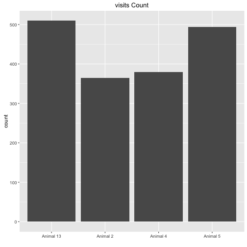

Visits over time for each animal   
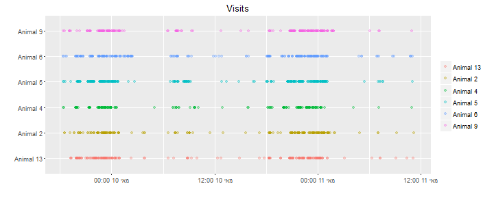

Visit count across absoulute time  


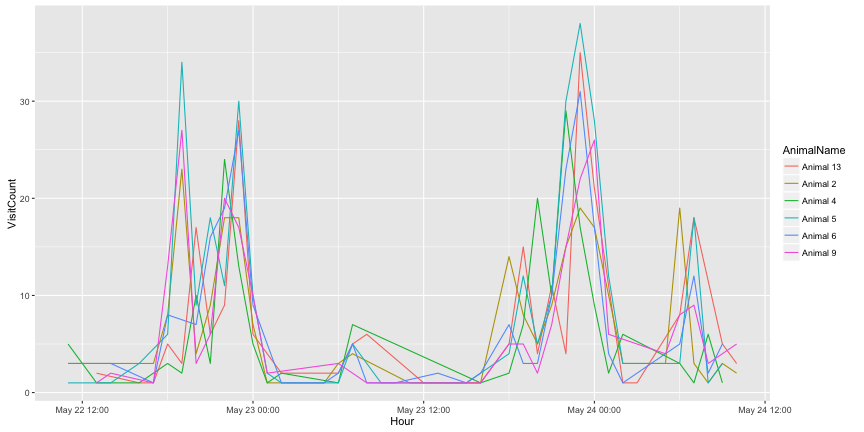


This is the hour with the maximun number of visits  

```
## [1] "2016-05-09 23:00:00 IDT"
```


This is the nosepokes count with the appropriate plot 

```
## 
## Animal 13  Animal 2  Animal 4  Animal 5  Animal 6  Animal 9 
##       180       159       167       247       206       173
```

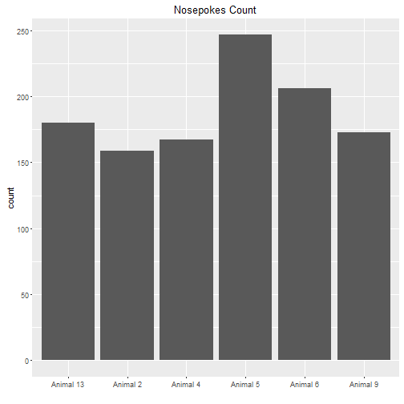


Nosepokes over time for each animal
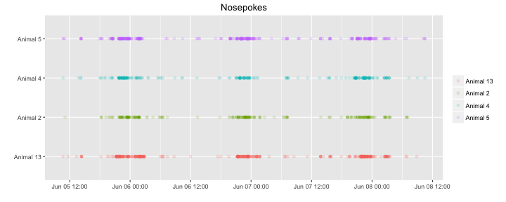

Check that drinking occoured only in the 19:00 23:59 time window, it shows the nosepokes where atleast one lick had happend, horizontal lines show the time window were the corner is active.
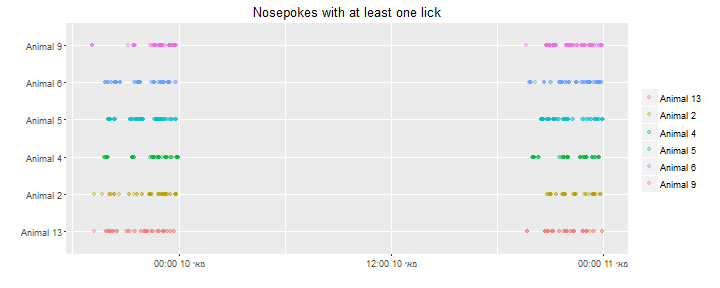


This is a plot showing the amount of nosepokes in the time window per day per animal  

```
## Error in `$<-.data.frame`(`*tmp*`, "Hour", value = c(14L, 15L, 15L, 15L, : replacement has 1024 rows, data has 1132
```

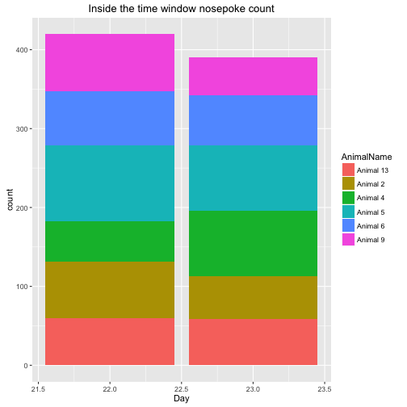

This is the count of nosepokes per day per animal in the time windows  


This is a table of the mean reaction time for each condition for each mouse only on trails when light appeared,
including time errors.  

```
##   Injection Sound MeanReactTime         SD        SEM
## 1       CNO   Off     0.4973504 0.17198529 0.07021270
## 2    Saline   Off     0.3876057 0.07184467 0.02933046
## 3       CNO    On     0.6296288 0.44587202 0.18202649
## 4    Saline    On     0.3358446 0.06473460 0.02642779
```

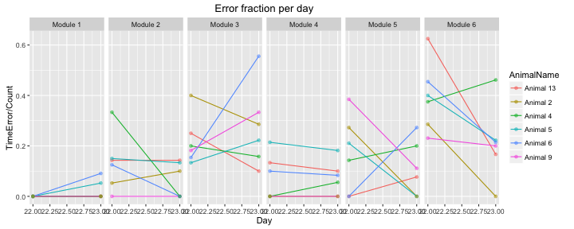


This is a plot showing the fraction of errors per time window per module,
the number of the module corresponds the anticipation time in seconds.
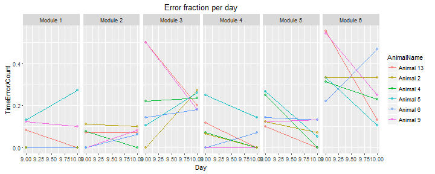

```
##    AnimalName Day ModuleName Count TimeError ImpulseError ErrorFraction
## 1   Animal 13  10   Module 6    15         2            2    0.13333333
## 2    Animal 9  10   Module 6     8         2            2    0.25000000
## 3    Animal 5  10   Module 6    19         2            2    0.10526316
## 4    Animal 6  10   Module 6    17         8            6    0.47058824
## 5    Animal 4  10   Module 6    13         3            3    0.23076923
## 6    Animal 2  10   Module 6    15         5            5    0.33333333
## 7   Animal 13   9   Module 6     9         5            4    0.55555556
## 8    Animal 9   9   Module 6    11         6            6    0.54545455
## 9    Animal 5   9   Module 6    18         6            6    0.33333333
## 10   Animal 6   9   Module 6     9         2            2    0.22222222
## 11   Animal 4   9   Module 6    16         5            5    0.31250000
## 12   Animal 2   9   Module 6     6         2            2    0.33333333
## 13  Animal 13  10   Module 4    10         0            0    0.00000000
## 14   Animal 9  10   Module 4    19         0            0    0.00000000
## 15   Animal 5  10   Module 4     7         1            1    0.14285714
## 16   Animal 6  10   Module 4    14         1            1    0.07142857
## 17   Animal 4  10   Module 4     8         0            0    0.00000000
## 18   Animal 2  10   Module 4     6         0            0    0.00000000
## 19  Animal 13   9   Module 4    17         2            0    0.11764706
## 20   Animal 9   9   Module 4    11         0            0    0.00000000
## 21   Animal 5   9   Module 4    20         5            2    0.25000000
## 22   Animal 6   9   Module 4    12         0            0    0.00000000
## 23   Animal 4   9   Module 4    14         1            0    0.07142857
## 24   Animal 2   9   Module 4    15         1            1    0.06666667
## 25  Animal 13  10   Module 2    14         1            0    0.07142857
## 26   Animal 9  10   Module 2    12         1            1    0.08333333
## 27   Animal 5  10   Module 2    16         1            1    0.06250000
## 28   Animal 6  10   Module 2    16         1            1    0.06250000
## 29   Animal 4  10   Module 2     8         0            0    0.00000000
## 30   Animal 2  10   Module 2    10         1            1    0.10000000
## 31  Animal 13   9   Module 2    14         1            1    0.07142857
## 32   Animal 9   9   Module 2    12         0            0    0.00000000
## 33   Animal 5   9   Module 2    14         0            0    0.00000000
## 34   Animal 6   9   Module 2    14         0            0    0.00000000
## 35   Animal 4   9   Module 2    13         1            1    0.07692308
## 36   Animal 2   9   Module 2     9         1            0    0.11111111
## 37  Animal 13  10   Module 1     8         0            0    0.00000000
## 38   Animal 9  10   Module 1    10         1            0    0.10000000
## 39   Animal 5  10   Module 1    11         3            0    0.27272727
## 40   Animal 6  10   Module 1    12         0            0    0.00000000
## 41   Animal 4  10   Module 1    16         0            0    0.00000000
## 42   Animal 2  10   Module 1     6         0            0    0.00000000
## 43  Animal 13   9   Module 1    12         1            1    0.08333333
## 44   Animal 9   9   Module 1     8         1            0    0.12500000
## 45   Animal 5   9   Module 1    15         2            0    0.13333333
## 46   Animal 6   9   Module 1     8         0            0    0.00000000
## 47   Animal 4   9   Module 1    11         0            0    0.00000000
## 48   Animal 2   9   Module 1    11         0            0    0.00000000
## 49  Animal 13  10   Module 3    10         2            2    0.20000000
## 50   Animal 9  10   Module 3    11         2            2    0.18181818
## 51   Animal 5  10   Module 3    19         5            4    0.26315789
## 52   Animal 6  10   Module 3    11         2            2    0.18181818
## 53   Animal 4  10   Module 3    17         4            4    0.23529412
## 54   Animal 2  10   Module 3    11         3            2    0.27272727
## 55  Animal 13   9   Module 3    12         6            6    0.50000000
## 56   Animal 9   9   Module 3     6         3            3    0.50000000
## 57   Animal 5   9   Module 3    19         2            2    0.10526316
## 58   Animal 6   9   Module 3    14         2            2    0.14285714
## 59   Animal 4   9   Module 3    18         4            4    0.22222222
## 60   Animal 2   9   Module 3     9         0            0    0.00000000
## 61  Animal 13  10   Module 5     7         0            0    0.00000000
## 62   Animal 9  10   Module 5    15         2            2    0.13333333
## 63   Animal 5  10   Module 5    19         1            1    0.05263158
## 64   Animal 6  10   Module 5    15         2            1    0.13333333
## 65   Animal 4  10   Module 5     9         0            0    0.00000000
## 66   Animal 2  10   Module 5    14         1            1    0.07142857
## 67  Animal 13   9   Module 5    10         1            1    0.10000000
## 68   Animal 9   9   Module 5    16         2            2    0.12500000
## 69   Animal 5   9   Module 5    15         4            1    0.26666667
## 70   Animal 6   9   Module 5    14         2            2    0.14285714
## 71   Animal 4   9   Module 5    12         3            3    0.25000000
## 72   Animal 2   9   Module 5     8         1            0    0.12500000
```

This is an histogram showing the reaction times(values under zero are nosepokes before the light cue) by Day by anticipation time, the salmon colored line is the overall median reaction time:
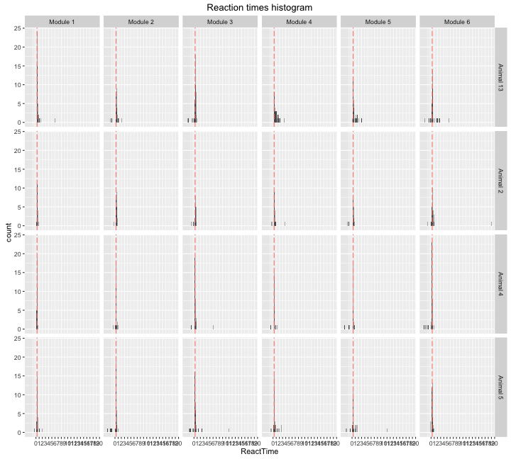

```
## [1] "The median reaction time in seconds:0.309999942779541"
```


These are the summarized results

```
##   Injection Sound       Mean        SEM
## 1       CNO    On 0.17783030 0.03205004
## 2    Saline    On 0.15250109 0.04044390
## 3       CNO   Off 0.08498618 0.01794731
## 4    Saline   Off 0.14605698 0.03840675
```

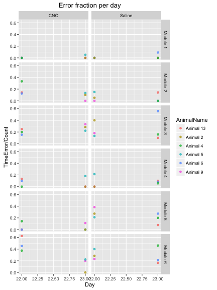


```
##   Injection Sound MeanImpulseError         SD        SEM
## 1       CNO   Off       0.06188212 0.08203925 0.03349238
## 2    Saline   Off       0.11598654 0.16032167 0.06545105
## 3       CNO    On       0.13723350 0.13160597 0.05372791
## 4    Saline    On       0.13979230 0.16132532 0.06586079
```

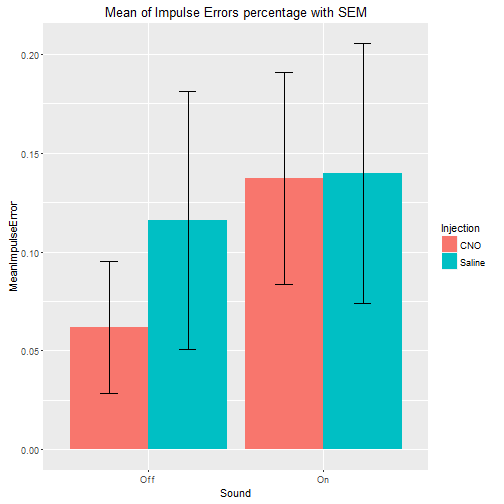
 
##Conclusion  
